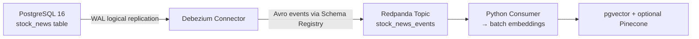

# Debezium CDC Setup

**How real-time changes from PostgreSQL reach your vector database.**

## Why Debezium?

- Tails the **PostgreSQL Write-Ahead Log (WAL)** instantly
- Captures INSERT / UPDATE / DELETE with **zero app changes**
- Automatic initial snapshot + continuous streaming
- Built-in support for deletes (tombstones)

## Architecture



## Critical PostgreSQL Setting

```sql
ALTER TABLE stock_news REPLICA IDENTITY FULL;
```

**This is what makes deletes work.**  
It forces Postgres to log the full row on DELETE so Debezium can send a proper tombstone event.

## Connector Highlights (connect/debezium-connector.json)

| Setting                        | Value              | Why it matters                              |
|--------------------------------|--------------------|---------------------------------------------|
| `snapshot.mode`                | `initial`          | Seeds all existing data on first run        |
| `table.include.list`           | `public.stock_news`| Only our demo table                         |
| `value.converter`              | `AvroConverter`    | Schema evolution + Registry                 |
| `transforms.unwrap.drop.tombstones` | `false`       | **Keeps delete events**                     |
| `topic.prefix`                 | `stock_news`       | Clean topic name                            |

Everything else is auto-configured in `docker-compose.yml`.

## One-Command Deployment

```bash
make up                    # Starts everything + auto-registers connector
make connector-status      # Should show "RUNNING"
```

No manual curl needed.

## What the Events Look Like

### CREATE / UPDATE
Normal record with `op: "c"` or `op: "u"`

### DELETE (Tombstone) — The Important One
```json
{
  "op": "d",
  "after": null,
  "before": { "id": 42, "ticker": "TSLA", ... }
}
```

The Python consumer detects `op == "d"` and **immediately deletes** the vector from pgvector/Pinecone. This proves data integrity.

## Quick Checks

```bash
# See live events flowing
docker exec pipeline_redpanda rpk topic consume stock_news_events --format=json

# Open Redpanda Console (best UI)
open http://localhost:8080
```

## Common Quick Fixes

| Problem                    | Fix                                      |
|----------------------------|------------------------------------------|
| Connector not running      | `make logs-debezium`                     |
| No events in Kafka         | `make insert-test` then check topic      |
| Delete not working         | Confirm `REPLICA IDENTITY FULL` in Postgres |

Full logs and status are always available via Makefile.
